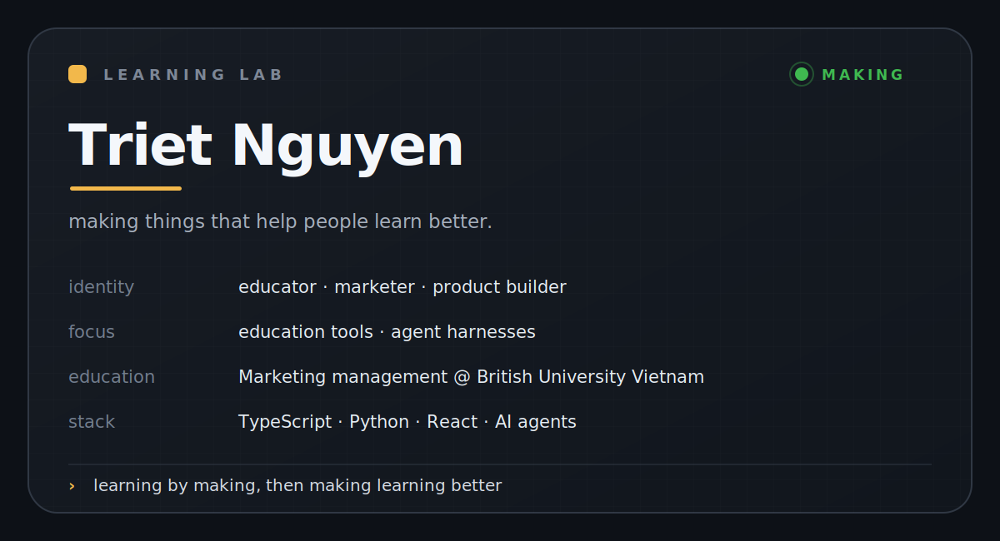
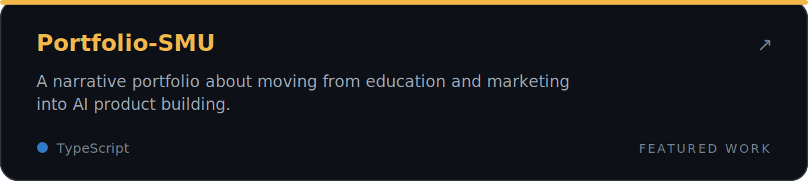
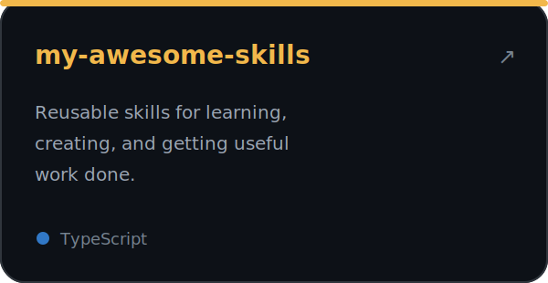
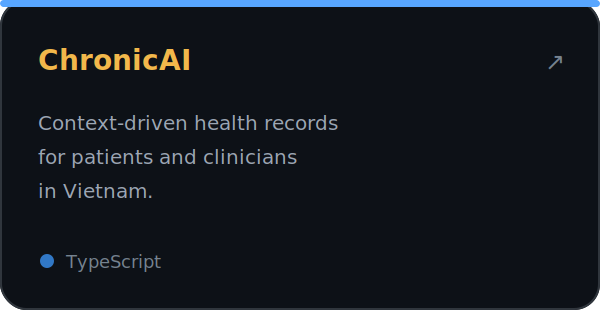

  <picture>
    <source media="(max-width: 600px)" srcset="./assets/learning-lab-mobile.svg" />
    
  </picture>

## Checkpoints

Selected things I have made — newest first.

 

<table>
  <tr>
    <td width="50%">
      
    </td>
    <td width="50%">
      
    </td>
  </tr>
</table>

## Connect

I am always happy to talk about education, products, and useful applications of AI.

[Email](mailto:triet2one@gmail.com) · [LinkedIn](https://www.linkedin.com/in/triet-nguyen-minh) · [Facebook](https://www.facebook.com/bryann510/)
